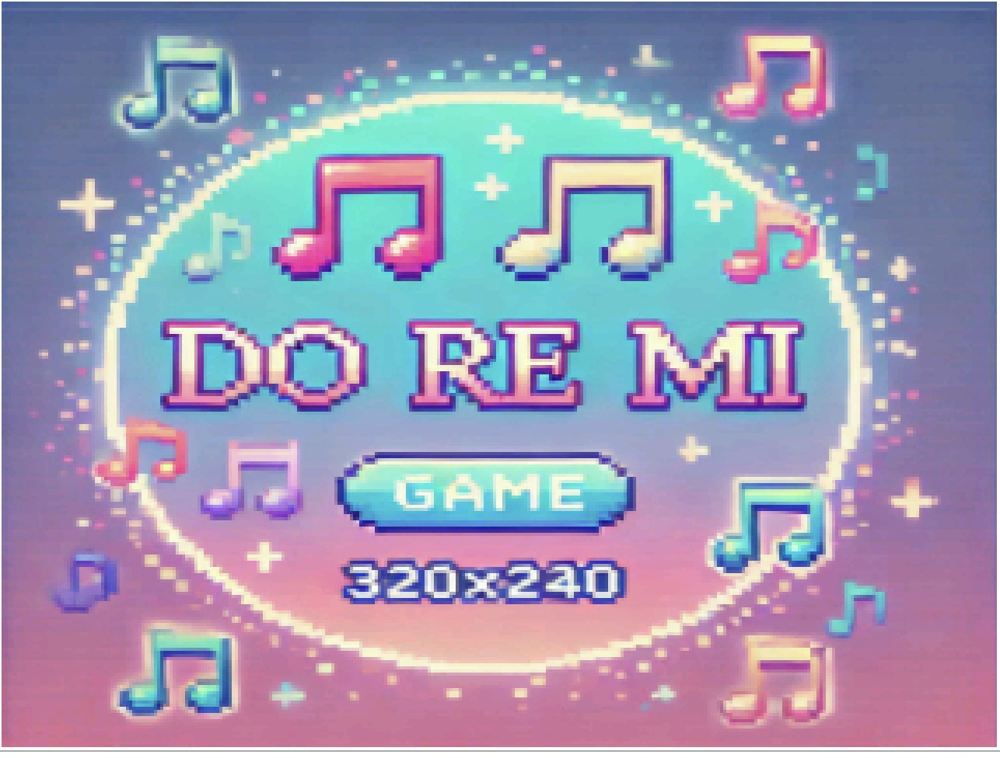

# DoReMi - FPGA Audio-Interactive Game

DoReMi is a single-player audio-based game developed on the DE1-SoC FPGA board. The player controls a musical note by singing different pitches (Do, Re, Mi, Fa, So, La, Ti) to surpass obstacles rendered on the screen. The game integrates real-tme VGA graphics rendering with audio signal processing to create an interactive game where audio input directly controls gameplay. 

## Game Overview

## How It Works
- The game starts when the user presses KEY0, signalling the transition from the title screen to the game screen.
- A target note (Do, Re, Mi, Fa, So, La, Ti) is displayed on the screen, while a musical note attemps to pass through the obstacles.
- The user's input note is transformed from the time-domain to the frequency-domain by passing it through a custom Fast Fourier Transform (FFT) (Cooley-Tukey, radix-2 DIT) to extract the peak frequency.
- The detected pitch is displayed on HEX0 through 7-segment decoding logic and compared to the target note.
    - If the pitch matches, the musical note advances past the obstacle.
    - Otherwise, the musical note remains stationary until the correct pitch is detected from the user.
- Once the user successfully sings all the target notes, the game transitions to the end screen, signalling that the user has won.
- The user can replay the game by pressing KEY1.

## Highlights
- **Graphics Display**
  - Programmed the DE1-SoC board to interface with the VGA controller to render dynamic and smooth graphics using double buffering, pixel plotting, and bitmap character mapping.
- **Audio Signal Processing**
  - Implemented a custom FFT (Cooley-Tukey, radix-2 DIT) in C to transfotm time-domain signals into frequency-domain data.
  - The FFt processes an array of audio samples and outputs an array of frequnecy bins, each containing a magntitude. The peak magnitude indicates the pitch, which is used to compare with the target pitch.
- **Game State Logic**
  - Developed a state machine logic to handle transitions between the title, gameplay, and end screens.
  - Integrated FPGA board inputs (KEY0, KEY1)
- **Hardware/Software Integration**
  - Utilized VGA rendering, FFT audio processing, and I/O reception on the DE1-SoC board.
